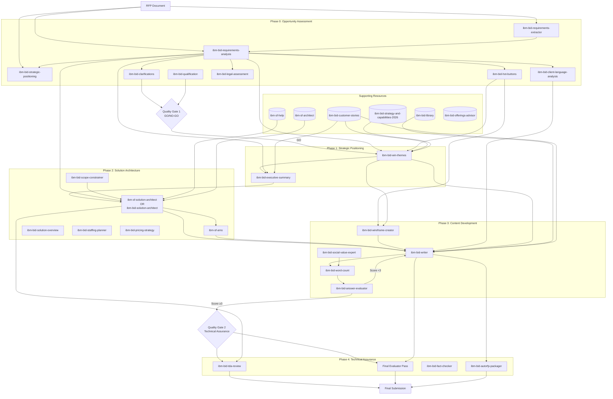

# IBM Bid Skills Matrix

Comprehensive decision logic, skill comparison, input/output mappings, and dependency graph for core workflow skills plus supporting resources.

## Complete Skill Inventory

### Core Workflow Skills (26, including optional and conditional skills)

| Phase | Skill Name | Primary Purpose | Execution Mode | Typical Duration |
|-------|------------|-----------------|----------------|------------------|
| 0 | ibm-bid-requirements-extractor | Extract requirements into a TODO checklist from PDFs/DOCX/spreadsheets | Individual (Step 0, optional) | 10-20 min |
| 0 | ibm-bid-requirements-analysis | Extract and analyze tender requirements (Level 1-2) | Individual (Step 1) | 15-25 min |
| 0 | ibm-bid-strategic-positioning | Strategic analysis and price-to-win (Level 3) | Individual (Step 2) | 10-20 min |
| 0/1/3 | ibm-bid-competitor-analysis | Black-hat review, likely bidder analysis, and IBM counter-positioning | Individual | 20-60 min |
| 0 | ibm-bid-clarifications | Identify ambiguous requirements | Individual (Step 2) | 15-30 min |
| 0 | ibm-bid-qualification | Score opportunity (GO/NO-GO) | Individual (Step 2) | 15-30 min |
| 0 | ibm-bid-hot-buttons | Extract exactly 5 client hot buttons from procurement language | Individual (Step 2, optional) | 15-30 min |
| 0 | ibm-bid-client-language-analysis | Build vocabulary, tone, and phrase profile from client documents | Individual (optional) | 20-40 min |
| 0 | ibm-bid-legal-assessment | Assess contract terms and legal risk against IBM criteria | Individual (Step 2, optional) | 20-45 min |
| 1 | ibm-bid-win-themes | Generate Shipley-compliant themes | Individual | 45-90 min |
| 1 | ibm-bid-executive-summary | Write executive summary | Individual | 30-60 min |
| 2 | ibm-sf-solution-architect | Salesforce solution architecture | Iterative | 4-6 hours |
| 2 | ibm-sf-ams | Size Salesforce AMS support model | Individual | 60 min |
| 2 | ibm-bid-solution-architect | Non-SF solution architecture | Iterative | 4-6 hours |
| 2 | ibm-bid-solution-overview | High-level architecture overview (concise, up to 10,000 words) | Individual | 60-120 min |
| 2 | ibm-bid-scope-constrainer | Bound open-ended requirements before solution design | Individual | 15-30 min |
| 2 | ibm-bid-staffing-planner | Build staffing plan, delivery duration, cost, price, GP/GP%, and location-mix scenarios | Individual | 30-90 min |
| 2 | ibm-bid-pricing-strategy | Develop pricing strategy, value-based commercial model, TCO/margin scenarios, concessions, and negotiation guardrails | Individual | 30-90 min |
| 3 | ibm-bid-wireframe-creator | Structure question responses with "How we..." sections before drafting | Per question | 10-20 min/Q |
| 3 | ibm-bid-writer | Draft tender responses | Per question | 20-45 min/Q |
| 3 | ibm-bid-social-value-expert | Draft UK public sector social value responses (TOMs framework) | Per question | 20-45 min/Q |
| 3 | ibm-bid-image-definer | Define AI-ready image prompts for bid answers (optional) | Per answer | 10-20 min |
| 3 | ibm-bid-word-count | Count words against tender limits (strips markdown syntax) | Per response | 2-5 min |
| 3 | ibm-bid-answer-evaluator | Evaluate response quality | Per response | 10-15 min/Q |
| 4 | ibm-bid-tda-review | Technical Design Authority review | Individual | 60-120 min |
| 4 | ibm-bid-fact-checker | Source-grounding and hallucination prevention | Individual | 30-60 min |
| 4 | ibm-bid-autorfp-packager | Package finalised responses into validated AutoRFP markdown documents | Individual | 20-40 min |

### Supporting Resources (Available Throughout)

| Resource Type | Resource Name | Content | Search Method |
|---------------|---------------|---------|---------------|
| Knowledge Base | ibm-bid-library | 3000+ historical responses, technical docs | SQLite FTS5 |
| Knowledge Base | ibm-bid-customer-stories | 857 customer success stories | SQLite FTS5 |
| Knowledge Base | ibm-bid-strategy-and-capabilities-2026 | IBM 2026 strategy and capabilities | Direct reference |
| Offerings | ibm-bid-offerings-advisor | IBM offerings mapped to needs/requirements | Local offerings corpus |
| Technical | ibm-sf-help | Salesforce Help Center documentation | SQLite FTS5 |
| Technical | ibm-sf-architect | Salesforce architecture patterns | Direct reference |
| Presentation | ibm-story-* skills (18 skills) | Storytelling and presentation | Skill invocation |

---

## Decision Logic: Which Skill When?

### By Tender Stage

```
Just Received RFP → Phase 0 Skills (Sequential then Parallel)
  Step 0 (optional, run first if needed):
  └─ If requirements are in spreadsheets or you need a checklist: ibm-bid-requirements-extractor

  Step 1 (run next, after Step 0 if used):
  └─ Always: ibm-bid-requirements-analysis

  Step 2 (run after Step 1, in parallel):
  ├─ Always: ibm-bid-strategic-positioning
  ├─ If competitor field, incumbent threat, or black-hat review matters: ibm-bid-competitor-analysis
  ├─ If ambiguous requirements: ibm-bid-clarifications
  └─ If >£1M: ibm-bid-qualification

After Qualification (GO decision) → Phase 1 Skills (Sequential)
  ├─ Optional black-hat checkpoint: ibm-bid-competitor-analysis
  ├─ Always: ibm-bid-win-themes
  └─ If executive summary required: ibm-bid-executive-summary

After Strategic Positioning → Phase 2 Skills (Conditional)
  ├─ If Salesforce implementation: ibm-sf-solution-architect
  │   └─ If ongoing AMS required: ibm-sf-ams
  ├─ If non-Salesforce technical: ibm-bid-solution-architect
  ├─ If staffing/cost/GP baseline required: ibm-bid-staffing-planner
  ├─ If pricing strategy/commercial model/negotiation guardrails required: ibm-bid-pricing-strategy
  └─ If no technical solution: Skip to Phase 3

After Solution Architecture → Phase 3 Skills (Iterative)
  ├─ Optional pre-redraft black-hat pass: ibm-bid-competitor-analysis
  ├─ For each question: ibm-bid-writer
  └─ For each response: ibm-bid-answer-evaluator
      └─ If score <3: Return to ibm-bid-writer

After Content Development → Phase 4 Skills (Parallel)
  ├─ If technical solution exists: ibm-bid-tda-review
  └─ Always: Final ibm-bid-answer-evaluator pass
```

### By Tender Type

| Tender Type | Required Skills | Optional Skills | Skip |
|-------------|-----------------|-----------------|------|
| **Government Salesforce (£10M+)** | Analysis, Competitor Analysis, Clarifications, Qualification, Win Themes, Executive Summary, SF Solution Architect, SF AMS, Staffing Planner, Pricing Strategy, Writer, Evaluator, TDA Review | Story skills (if oral presentation) | None |
| **Commercial Infrastructure (£5M)** | Analysis, Competitor Analysis, Qualification, Win Themes, Bid Solution Architect, Staffing Planner, Pricing Strategy, Writer, Evaluator, TDA Review | Executive Summary, Clarifications | SF skills |
| **Framework Call-Off (<£1M)** | Analysis, Competitor Analysis, Qualification, Win Themes, Pricing Strategy, Writer, Evaluator | Clarifications, Staffing Planner if delivery team shape is evaluated | Phase 2 technical architecture unless requested |
| **Managed Services (AMS only)** | Analysis, Qualification, Win Themes, SF AMS, Staffing Planner, Pricing Strategy, Writer, Evaluator | Executive Summary | SF Solution Architect |
| **Professional Services (<£500K)** | Analysis, Win Themes, Pricing Strategy, Writer, Evaluator | Qualification, Executive Summary, Staffing Planner | Phase 2 technical architecture |

### By User Question

| User Says... | Recommended Skill | Rationale |
|--------------|-------------------|-----------|
| "I have a requirements spreadsheet" | ibm-bid-requirements-extractor | Create a structured checklist before analysis |
| "I just received an RFP" | ibm-bid-requirements-analysis | Always start with requirements analysis |
| "Who are we up against?" | ibm-bid-competitor-analysis | Identify likely bidders, incumbent advantage, and attack lines |
| "Should we bid this?" | ibm-bid-qualification | Systematic GO/NO-GO decision |
| "What questions should we ask the client?" | ibm-bid-clarifications | Identify ambiguities |
| "How should we position?" | ibm-bid-win-themes | Strategic competitive positioning |
| "Write the executive summary" | ibm-bid-executive-summary | Compelling summary |
| "Design the Salesforce solution" | ibm-sf-solution-architect | Technical architecture |
| "Size the support team" | ibm-sf-ams | FTE calculation |
| "Which IBM offerings fit this?" | ibm-bid-offerings-advisor | Map requirements or business needs to IBM offerings |
| "Create a high-level solution overview" | ibm-bid-solution-overview | Concise architecture overview for executive or high-level technical positioning |
| "Build the staffing plan" | ibm-bid-staffing-planner | Team shape, duration, cost, price, GP/GP%, and location mix |
| "Develop the pricing strategy" | ibm-bid-pricing-strategy | Commercial model, value-based contracting, price-to-win scenarios, concessions, and negotiation guardrails |
| "How do we defend the price?" | ibm-bid-pricing-strategy | Price objection handling, tradeables, ZOPA/walkaway, and negotiation readiness |
| "Move from FTE/PxQ to value-based pricing" | ibm-bid-pricing-strategy | Value-based contracting model and incentive alignment |
| "Design the infrastructure solution" | ibm-bid-solution-architect | Non-SF technical architecture |
| "Answer this tender question" | ibm-bid-writer | Response drafting |
| "What images would strengthen this answer?" | ibm-bid-image-definer | Visual recommendations |
| "Review this answer" | ibm-bid-answer-evaluator | Quality assessment |
| "Review the technical solution" | ibm-bid-tda-review | Technical assurance |
| "Is this ready to submit?" | Final ibm-bid-answer-evaluator | Pre-submission validation |

---

## Skill Comparison Matrix

### Analysis Skills (Phase 0)

| Skill | Focus | Output Structure | When to Use | When to Skip |
|-------|-------|------------------|-------------|--------------|
| **ibm-bid-requirements-extractor** | Structure requirements into a TODO checklist | ../tmp/ibm-bid-requirements_extractor.md with requirements table, clarifications, gaps | Requirements in spreadsheets or need a checklist | When full analysis is the only requirement |
| **ibm-bid-requirements-analysis** | Extract and analyze tender requirements | Client profile, requirements (5-10), operational gaps, capability deficits, risk profile | Every tender (Step 1) | Never skip |
| **ibm-bid-strategic-positioning** | Strategic analysis and commercial positioning | Executive drivers, sales strategy, price-to-win (5 viewpoints), win theme inputs | Every tender (Step 2) | Never skip |
| **ibm-bid-competitor-analysis** | Likely bidder analysis and black-hat review | Threat-ranked competitor view, attack lines on IBM, counter-positioning, response surgery | When competitor field, incumbent threat, or counter-positioning matters | Very small low-competition bids or clear sole-source situations |
| **ibm-bid-clarifications** | Identify ambiguous/incomplete requirements | 10-20 clarification questions | Complex requirements, government tenders | Simple, clear RFPs |
| **ibm-bid-qualification** | Score opportunity against 20 criteria | Qualification score (0-100) + GO/NO-GO | >£1M opportunities | <£1M or strategic relationship |
| **ibm-bid-hot-buttons** | Extract exactly 5 client priorities from procurement language | ../tmp/ibm-bid-hot-buttons.md (5 hot buttons in client voice) | Always before Phase 1; feeds win-themes and wireframe-creator | Never skip when running Phase 1 |
| **ibm-bid-client-language-analysis** | Profile client vocabulary, tone, and preferred phrases | ../tmp/ibm-bid-client-language-analysis.md | Recommended before writing; writer uses automatically when present | Very short or informal bids |
| **ibm-bid-legal-assessment** | Assess contract terms against IBM legal risk criteria | ../tmp/ibm-bid-legal-assessment.md | UK government tenders with contract schedules or draft terms | When no contract terms provided |

### Strategic Skills (Phase 1)

| Skill | Focus | Output Structure | When to Use | When to Skip |
|-------|-------|------------------|-------------|--------------|
| **ibm-bid-win-themes** | Competitive positioning themes | 3-7 Shipley-compliant win themes | Every competitive tender | Non-competitive renewals |
| **ibm-bid-executive-summary** | Compelling 1000-word summary | 4-part structure: Challenge, Solution, Proof, Partnership | When RFP requires summary | When not required |

### Solution Architecture Skills (Phase 2)

| Skill | Focus | Output Structure | When to Use | When to Skip |
|-------|-------|------------------|-------------|--------------|
| **ibm-sf-solution-architect** | Salesforce technical solution | 16 sections (architecture, data, security, integrations, etc.) | Salesforce implementations | Non-Salesforce bids |
| **ibm-sf-ams** | Size ongoing support model | FTE estimate with ticket volume calculations | When ongoing AMS required | Implementation-only bids |
| **ibm-bid-solution-overview** | High-level architecture overview | Concise architecture overview, up to 15 sections and 10,000 words | Executive summaries, solution positioning, or early-stage technical overview | When full detailed architecture is required instead |
| **ibm-bid-scope-constrainer** | Bound open-ended requirements before designing a solution | ../tmp/ibm-bid-scope-constrainer.md (3-5 bounding statements per requirement) | Before solution design when requirements are vague or unlimited | When requirements are tightly and unambiguously specified |
| **ibm-bid-staffing-planner** | Bid-ready staffing and commercial baseline | Team composition, duration, cost, price, GP, GP%, location mix, scenario comparison | When staffing, delivery cost, GP, or location mix is needed | When a complete approved staffing plan already exists |
| **ibm-bid-pricing-strategy** | Pricing and commercial strategy | Commercial model, cost-to-price baseline, value-based contracting design, TCO/margin scenarios, concession/negotiation guardrails | When pricing, discounts, commercial model, value-based contracting, price defence, or negotiation readiness is needed | When RFP has no pricing/commercial content and no negotiation support is required |
| **ibm-bid-solution-architect** | Non-Salesforce technical solution | 15 sections (system arch, tech stack, infrastructure, security, etc.) | Infrastructure, cloud, cybersecurity bids | Salesforce or non-technical bids |

### Content Development Skills (Phase 3)

| Skill | Focus | Output Structure | When to Use | When to Skip |
|-------|-------|------------------|-------------|--------------|
| **ibm-bid-wireframe-creator** | Pre-writing structure and hot button/win theme mapping | ../tmp/ibm-bid-wireframe-Q0X.md ("How we..." sub-headings with strategic mapping) | Before every complex question response | Very simple, low-word-count questions |
| **ibm-bid-writer** | Draft tender responses | Structured response per question | Every question requiring written response | Pre-written or template responses |
| **ibm-bid-social-value-expert** | Draft UK public sector social value responses | ../tmp/ibm-bid-responses/social-value.md (TOMs framework, measurable commitments, governance) | Any scored social value question in UK public sector tender | When no social value requirement exists |
| **ibm-bid-image-definer** | Define visuals for bid answers | AI-ready image prompts with IBM style guidance | When answers would benefit from diagrams or imagery | Text-only submissions or when images aren't evaluated |
| **ibm-bid-word-count** | Check response word count against tender limits | Word count result and pass/fail status | Before evaluating any response with a word limit | When no word limit applies |
| **ibm-bid-answer-evaluator** | Assess response quality | 5-point scale across 5 dimensions | After every response drafted | Never skip (quality assurance) |

### Assurance Skills (Phase 4)

| Skill | Focus | Output Structure | When to Use | When to Skip |
|-------|-------|------------------|-------------|--------------|
| **ibm-bid-tda-review** | Technical architecture validation | Risk rating (LOW/MEDIUM/HIGH) per 7 dimensions | When technical solution exists | Non-technical bids |
| **ibm-bid-fact-checker** | Source-grounding and hallucination prevention | Claim-by-claim validation against RFP/ITT/source documents | Before final submission or when claims/metrics need support | When no generated content or claims require verification |
| **Final ibm-bid-answer-evaluator** | Pre-submission validation | Comprehensive evaluation report | Before every submission | Never skip (final QA) |
| **ibm-bid-autorfp-packager** | Package finalised responses into AutoRFP submission format | ../tmp/ibm-bid-autorfp-pack/ (validated .md files per requirement) | When submitting via AutoRFP system; run after all Phase 3 content is complete | Direct submission only (no AutoRFP) |

---

## Input/Output Mapping

### ibm-bid-requirements-extractor

**Inputs:**
- RFP.pdf or ITT.pdf (tender document)
- Requirements spreadsheet (XLSX/CSV/TSV)
- Optional: Multiple files (list all inputs)

**Outputs:**
- ../tmp/ibm-bid-requirements-extractor.md containing:
  - Requirements table with IDs, section refs, type, and evidence pointers
  - Clarification questions list
  - Risks/gaps checklist
  - Checklist status section for downstream processing

**Consumed By:**
- ibm-bid-requirements-analysis (as a checklist/reference)
- ibm-bid-clarifications (uses the extracted questions and gaps)

---

### ibm-bid-requirements-analysis

**Inputs:**
- RFP.pdf or ITT.pdf (primary tender document)
- Optional: Client background materials
- Optional: Previous bid analysis (for rebids)

**Outputs:**
- ../tmp/ibm-bid-requirements-analysis.md containing:
  - Client profile (organization, industry, context)
  - Requirements (5-10 key requirements)
  - Operational gaps (what's broken)
  - Capability deficits (technical/organizational/process)
  - Risk profile (explicit + implicit)
  - Competitive landscape (incumbent signals, likely bidders)

**Consumed By:**
- ibm-bid-strategic-positioning (primary next step)
- ibm-bid-qualification (uses requirements and risk profile)
- ibm-bid-clarifications (uses requirements for context)
- ibm-bid-win-themes (uses needs and gaps)
- ibm-bid-executive-summary (uses client profile)
- ibm-bid-writer (references throughout)

---

### ibm-bid-strategic-positioning

**Inputs:**
- ../tmp/ibm-bid-requirements-analysis.md (required)

**Outputs:**
- ../tmp/ibm-bid-strategic-positioning.md containing:
  - Executive decision drivers
  - Transformation vs BAU assessment
  - Sales strategy selection (Attack/Position)
  - Price-to-win analysis (5 viewpoints)
  - Win theme inputs preparation
  - Competitive positioning strategy

**Consumed By:**
- ibm-bid-win-themes (uses win theme inputs and competitive positioning)
- ibm-bid-executive-summary (uses strategic approach)
- ibm-bid-qualification (uses price-to-win and strategic assessment)
- ibm-bid-writer (references strategic positioning)

---

### ibm-bid-clarifications

**Inputs:**
- RFP.pdf or ITT.pdf
- Optional: ../tmp/ibm-bid-requirements-analysis.md (for context)

**Outputs:**
- ../tmp/ibm-bid-clarifications.md containing:
  - List of 10-20 clarification questions
  - Categorized by: Ambiguous requirements, Missing details, Contradictions, Assumptions to validate
  - Priority ranking (HIGH/MEDIUM/LOW)

**Consumed By:**
- Tender clarification submission to client
- ibm-bid-qualification (informs risk assessment)

---

### ibm-bid-qualification

**Inputs:**
- RFP.pdf or ITT.pdf
- ../tmp/ibm-bid-requirements-analysis.md (required)
- ../tmp/ibm-bid-strategic-positioning.md (optional but recommended)
- Optional: ../tmp/ibm-bid-clarifications.md

**Outputs:**
- ../tmp/ibm-bid-qualification.md containing:
  - Qualification score (0-100) with category breakdown
  - GO/NO-GO recommendation
  - Red flags identified
  - Key risks and mitigation strategies
  - Resource requirements

**Consumed By:**
- Quality Gate 1 decision
- ibm-bid-project.md (updates state)
- Management approval process

---

### ibm-bid-competitor-analysis

**Inputs:**
- ../tmp/ibm-bid-requirements-analysis.md (required)
- Optional: ../tmp/ibm-bid-strategic-positioning.md
- Optional: ../tmp/ibm-bid-win-themes.md
- Optional: Draft answers or executive summary for black-hat review
- Optional: Public-source web research when current competitor signals matter

**Outputs:**
- ../tmp/ibm-bid-competitor-analysis.md containing:
  - Ranked likely competitors or archetypes
  - Incumbent advantage and threat hypotheses
  - Likely attack lines on IBM
  - IBM counter-positioning and response surgery
  - Public-source signals and source confidence notes, when used

**Consumed By:**
- ibm-bid-win-themes (differentiation and rebuttal shaping)
- ibm-bid-executive-summary (competitive emphasis)
- ibm-bid-writer (response surgery and proof priorities)
- ibm-bid-project.md (updates top competitor threats)

---

### ibm-bid-win-themes

**Inputs:**
- ../tmp/ibm-bid-requirements-analysis.md (required)
- ../tmp/ibm-bid-strategic-positioning.md (optional but recommended)
- ibm-bid-strategy-and-capabilities-2026 (IBM capabilities)
- ibm-bid-customer-stories (proof points via FTS5 search)
- Optional: Competitive intelligence

**Outputs:**
- ../tmp/ibm-bid-win-themes.md containing:
  - 3-7 Shipley-compliant win themes
  - Each theme structured: Headline, Benefit, Proof, Discriminator
  - Client-focused messaging
  - Competitive positioning

**Consumed By:**
- ibm-bid-executive-summary (incorporates themes)
- ibm-bid-writer (weaves themes into all responses)
- Oral presentation skills (if applicable)

---

### ibm-bid-executive-summary

**Inputs:**
- ../tmp/ibm-bid-requirements-analysis.md (required)
- ../tmp/ibm-bid-strategic-positioning.md (optional but recommended)
- ../tmp/ibm-bid-win-themes.md (required)
- ibm-bid-customer-stories (proof points via FTS5 search)
- Optional: ../tmp/ibm-sf-solution/complete_solution.md (for solution summary)

**Outputs:**
- ../tmp/ibm-bid-executive-summary.md containing:
  - 1000-word executive summary
  - 4-part structure: Challenge, Solution, Proof, Partnership
  - Incorporates win themes
  - Includes relevant customer success stories

**Consumed By:**
- Final submission package (copy to ../outputs/)
- Oral presentation (if required)

---

### ibm-sf-solution-architect

**Inputs:**
- ../tmp/ibm-bid-requirements-analysis.md (requirements)
- RFP requirements section
- ibm-sf-help (feature validation via FTS5 search)
- ibm-sf-architect (architecture patterns)
- Optional: User stories from client

**Outputs:**
- ../tmp/ibm-sf-solution/complete_solution.md containing 16 sections:
  1. Executive Summary
  2. Business Context & Objectives
  3. User Stories
  4. Solution Architecture Overview
  5. Data Model
  6. Security Architecture
  7. Integration Architecture
  8. Deployment Model
  9. User Training Plan
  10. Change Management
  11. Testing Strategy
  12. Go-Live Plan
  13. Success Metrics
  14. Risk Assessment
  15. Timeline
  16. Cost Breakdown

**Consumed By:**
- ibm-sf-ams (input for support sizing)
- ibm-bid-writer (references in technical responses)
- ibm-bid-tda-review (subject of technical review)

---

### ibm-sf-ams

**Inputs:**
- ../tmp/ibm-sf-solution/complete_solution.md (required)
- User counts from RFP
- Complexity assessment (simple/moderate/complex)

**Outputs:**
- ../tmp/ibm-sf-ams-estimation.md containing:
  - FTE requirements by role (Incident Manager, Service Desk, Technical Specialist, etc.)
  - Ticket volume estimates
  - Minor enhancement capacity
  - Non-ticketing activities allocation
  - IBM GenAI accelerator impact (15-25% productivity gain)
  - Multi-year staffing projections

**Consumed By:**
- ibm-bid-writer (commercial and support responses)
- Pricing team (cost model input)

---

### ibm-bid-staffing-planner

**Inputs:**
- Delivery scope, workload, or DCUT hours
- Project complexity, contract type, timeline, budget, and location-mix constraints
- Local staffing config copied from the skill assets

**Outputs:**
- ../tmp/ibm-bid-staffing-planner.md containing:
  - Recommended team shape
  - Duration and committed duration
  - Cost, price, GP, and GP%
  - Location mix and role allocation
  - Scenario comparison and rejected options
  - Assumptions, constraints, and delivery risks

**Consumed By:**
- ibm-bid-pricing-strategy (internal cost and GP baseline)
- ibm-bid-writer (staffing, delivery, and commercial response content)
- ibm-bid-qualification (commercial viability and resourcing risk)

---

### ibm-bid-pricing-strategy

**Inputs:**
- ../tmp/ibm-bid-staffing-planner.md or exported staffing model outputs, if available
- ../tmp/ibm-bid-strategic-positioning.md
- ../tmp/ibm-bid-requirements-analysis.md
- Solution architecture and AMS outputs, where applicable
- RFP pricing schedules, commercial terms, budget, and negotiation constraints

**Outputs:**
- Pricing strategy memo or model containing:
  - Recommended commercial model
  - Internal cost baseline and client-facing price strategy
  - Value-based contracting approach, if relevant
  - TCO, margin, and sensitivity scenarios
  - Discount, concession, and tradeable strategy
  - Negotiation guardrails: opening, target, walkaway, BATNA/WATNA, and ZOPA

**Consumed By:**
- ibm-bid-writer (pricing narrative, assumptions, commercial response sections)
- ibm-bid-executive-summary (commercial value and TCO messaging)
- ibm-bid-qualification (commercial viability)
- Pricing approval / deal governance

---

### ibm-bid-solution-architect

**Inputs:**
- ../tmp/ibm-bid-requirements-analysis.md (requirements)
- RFP technical requirements
- Optional: Architecture constraints from client

**Outputs:**
- ../tmp/ibm-bid-solution/complete_solution.md containing 15 sections:
  1. Executive Summary
  2. System Architecture
  3. Technology Stack
  4. Infrastructure Design
  5. Security Architecture
  6. Integration Architecture
  7. Deployment Model
  8. Scalability & Performance
  9. Data Architecture
  10. Disaster Recovery
  11. Operational Model
  12. Support Model
  13. Migration Approach
  14. Testing Strategy
  15. Risk Mitigation

**Consumed By:**
- ibm-bid-writer (references in technical responses)
- ibm-bid-tda-review (subject of technical review)

---

### ibm-bid-writer

**Inputs:**
- RFP question (required)
- ../tmp/ibm-bid-win-themes.md (strategic messaging)
- ibm-bid-library (historical responses via FTS5 search)
- ibm-bid-customer-stories (proof points via FTS5 search)
- Optional: ../tmp/ibm-sf-solution/complete_solution.md (technical context)
- Optional: ../tmp/ibm-bid-solution/complete_solution.md (technical context)

**Outputs:**
- ../tmp/ibm-bid-responses/Q0X_[topic].md per question containing:
  - Structured response addressing question
  - Evidence-based (customer stories, statistics, examples)
  - Incorporates win themes
  - Client-focused language

**Consumed By:**
- ibm-bid-image-definer (optional: visual recommendations for drafted answer)
- ibm-bid-answer-evaluator (quality assessment)
- Final submission package (copy to ../outputs/)

---

### ibm-bid-image-definer

**Inputs:**
- ../tmp/ibm-bid-responses/Q0X_[topic].md or pasted answer text (required)
- Optional: number of images requested, submission format, page limit

**Outputs:**
- Inline image recommendations, or ../tmp/ibm-bid-image-definer.md when persisted
- Each image defined with: concept, visual type, key message, IBM style guidance, AI-generation prompt

**Consumed By:**
- Proposal design / PowerPoint creation
- ibm-bid-answer-evaluator (stronger evidence and structure scores where visuals are present)

---

### ibm-bid-answer-evaluator

**Inputs:**
- RFP question (required)
- ../tmp/ibm-bid-responses/Q0X_[topic].md (response to evaluate)
- Optional: Evaluation criteria from RFP

**Outputs:**
- Score report in ../tmp/ibm-bid-responses/evaluation_report.md containing:
  - Understanding score (0-5)
  - Evidence score (0-5)
  - Structure score (0-5)
  - Clarity score (0-5)
  - Differentiation score (0-5)
  - Overall score (average)
  - Detailed feedback per dimension

**Consumed By:**
- ibm-bid-writer (feedback for revision if score <3)
- Quality Gate 2 (validates all scores ≥3)
- Final submission decision

---

### ibm-bid-tda-review

**Inputs:**
- ../tmp/ibm-sf-solution/complete_solution.md OR ../tmp/ibm-bid-solution/complete_solution.md (required)
- ../tmp/ibm-bid-responses/ (all technical responses)
- RFP requirements

**Outputs:**
- ../tmp/ibm-bid-tda-review.md containing:
  - Risk rating (LOW/MEDIUM/HIGH) for 7 dimensions:
    1. Requirements Alignment
    2. Resource Capability
    3. Scalability
    4. Security Architecture
    5. Integration Complexity
    6. Operational Readiness
    7. Technology Risk
  - Overall risk assessment
  - Specific recommendations per dimension
  - Mitigation strategies for MEDIUM/HIGH risks

**Consumed By:**
- Quality Gate 2 decision
- Management escalation (if HIGH risks)
- Final submission approval

---

### ibm-bid-hot-buttons

**Inputs:**
- RFP/ITT document (required)
- Optional: ../tmp/ibm-bid-requirements-analysis.md

**Outputs:**
- ../tmp/ibm-bid-hot-buttons.md containing:
  - Exactly 5 hot buttons written in first-person client voice
  - Each hot button: label, motivation, pain point, strategic concern

**Consumed By:**
- ibm-bid-win-themes (anchors themes to client priorities)
- ibm-bid-wireframe-creator (maps hot buttons to question sections)
- ibm-bid-writer (client-priority language for responses)

---

### ibm-bid-client-language-analysis

**Inputs:**
- Client documents: RFP, ITT, strategy docs, annual reports, previous tenders (required — at least one)
- Optional: ../tmp/ibm-bid-requirements-analysis.md (to cross-reference requirements language)

**Outputs:**
- ../tmp/ibm-bid-client-language-analysis.md containing:
  - Preferred vocabulary and terminology
  - Tone profile (formal/informal, technical depth)
  - Phrases to adopt and phrases to avoid
  - Structural and formatting preferences

**Consumed By:**
- ibm-bid-writer (uses automatically when file is present — mirrors client style)
- ibm-bid-executive-summary (tone and vocabulary alignment)

---

### ibm-bid-legal-assessment

**Inputs:**
- ITT documents, framework call-off terms, draft contract schedules (required)
- Optional: framework-specific reference (dos6.md, ts3.md, gcloud.md, ccs.md, departmental.md)

**Outputs:**
- ../tmp/ibm-bid-legal-assessment.md containing:
  - Assessment across 15 categories (liability, GDPR, exit, TUPE, warranties, etc.)
  - RED/AMBER/GREEN risk rating per category
  - Required clarification questions
  - Recommended redlines and negotiation positions

**Consumed By:**
- Quality Gate 1 decision (RED/AMBER risks may require mitigation before GO)
- ibm-bid-clarifications (legal questions fed into clarifications list)
- ibm-bid-strategic-positioning (commercial risk informs pricing and strategy)

---

### ibm-bid-scope-constrainer

**Inputs:**
- Open-ended or vague client requirements (from RFP or requirements analysis)
- Optional: ../tmp/ibm-bid-requirements-analysis.md

**Outputs:**
- ../tmp/ibm-bid-scope-constrainer.md containing:
  - 3-5 bounding statements per requirement
  - Domain-specific constraints (Salesforce, web, integration, data, AI/ML)
  - Estimate uncertainty reduction (typically 25-45%)

**Consumed By:**
- ibm-bid-solution-architect / ibm-sf-solution-architect (scoped requirements as design input)
- ibm-bid-pricing-strategy (bounded scope reduces commercial risk)
- ibm-bid-writer (scope boundaries inform assumptions sections)

---

### ibm-bid-solution-overview

**Inputs:**
- ../tmp/ibm-bid-requirements-analysis.md (required)
- Optional: ../tmp/ibm-bid-win-themes.md

**Outputs:**
- ../tmp/ibm-bid-solution/complete_solution.md containing:
  - Concise architecture overview (up to 15 sections, 10,000 words max)
  - High-level technical positioning suitable for executive audiences

**Consumed By:**
- ibm-bid-writer (high-level technical context for responses)
- ibm-bid-executive-summary (solution positioning)
- ibm-bid-tda-review (when used in place of full solution architecture)

---

### ibm-bid-wireframe-creator

**Inputs:**
- RFP question text (required)
- ../tmp/ibm-bid-hot-buttons.md (required)
- ../tmp/ibm-bid-win-themes.md (required)
- ../tmp/ibm-bid-approved-customer-stories.md (required)
- Optional: ../tmp/ibm-bid-requirements-analysis.md

**Outputs:**
- ../tmp/ibm-bid-wireframe-Q0X.md containing:
  - "How we..." sub-headings decomposing the question
  - Hot button and win theme mapping per section
  - Approved customer story placement recommendations
  - Word allocation guidance per section

**Consumed By:**
- ibm-bid-writer (wireframe is the primary drafting input)

---

### ibm-bid-word-count

**Inputs:**
- Markdown bid response file (required)
- Optional: heading to count from (default: "## Answer:")

**Outputs:**
- Word count result with:
  - Total word count of evaluator-facing content
  - Tender word limit (if provided)
  - Pass/fail status against limit

**Consumed By:**
- ibm-bid-answer-evaluator (word count check is a required pre-step when a limit applies)
- Human reviewer (confirms compliance before submission)

---

### ibm-bid-social-value-expert

**Inputs:**
- Social value question from RFP/ITT (required)
- ibm-bid-writer (required — used internally to draft response)
- ibm-bid-strategy-and-capabilities-2026 (required — IBM programmes and commitments)
- Optional: ../tmp/ibm-bid-requirements-analysis.md
- Optional: ../tmp/ibm-bid-win-themes.md
- Optional: ibm-bid-customer-stories (community and social impact proof points)

**Outputs:**
- ../tmp/ibm-bid-responses/social-value.md (or question-specific file) containing:
  - TOMs-aligned response (Themes, Outcomes, Measures)
  - Named IBM programmes with quantified commitments
  - Governance and monitoring and evaluation framework
  - 10 Standard Response Elements

**Consumed By:**
- ibm-bid-answer-evaluator (quality check)
- Final submission package

---

### ibm-bid-fact-checker

**Inputs:**
- Generated tender response (required)
- Source documents: RFP/ITT, requirements analysis, technical appendices (required)
- Optional: ../tmp/ibm-bid-approved-customer-stories.md (validates customer story references)

**Outputs:**
- ../tmp/ibm-bid-fact-check-report.md containing:
  - Claim-by-claim verification table
  - Source citation for each supported claim
  - Unsupported or potentially hallucinated statements flagged
  - Required corrections

**Consumed By:**
- Quality Gate 2 decision (unsupported claims must be corrected before submission)
- ibm-bid-writer (returned for revision if claims are unsupported)

---

### ibm-bid-autorfp-packager

**Inputs:**
- ../tmp/ibm-bid-project.md or ibm-bid-project.sqlite (required)
- ../tmp/ibm-bid-requirements-analysis.md (required)
- ../tmp/ibm-bid-strategic-positioning.md (required)
- ../tmp/ibm-bid-hot-buttons.md (required)
- ../tmp/ibm-bid-win-themes.md (required)
- ../tmp/ibm-bid-responses/Q*.md (all drafted responses, required)

**Outputs:**
- ../tmp/ibm-bid-autorfp-inputs/pack-context.yaml
- ../tmp/ibm-bid-autorfp-inputs/Q*.yaml (per-question answer-intent records)
- ../tmp/ibm-bid-autorfp-pack/*.md (validated AutoRFP-ready markdown per requirement)

**Consumed By:**
- AutoRFP submission system
- Human reviewer (validates before uploading)

---

## Dependency Graph



**Dependency Rules:**
0. **Optional pre-step**: ibm-bid-requirements-extractor can run before requirements-analysis when a checklist or spreadsheet extraction is needed
1. **Phase 0 must complete before Phase 1**: Requirements analysis and strategic positioning inform win themes and executive summary
2. **Phase 1 must complete before Phase 3**: Win themes must be established before writing responses
3. **Phase 2 can run in parallel with late Phase 1**: Solution architecture can start while executive summary is being written
4. **Phase 3 is iterative**: Writer and Evaluator loop until quality threshold met
5. **Phase 4 requires Phase 2 & 3 complete**: TDA reviews solution architecture, Final Evaluator reviews all responses
6. **Supporting resources available throughout**: Can be invoked at any phase

---

## Skill Selection Decision Tree

```
START: User has received tender document
│
├─ Q0: Are requirements in a spreadsheet or do you need a checklist?
│  ├─ Yes → Run ibm-bid-requirements-extractor, then proceed to Q1
│  └─ No → Proceed to Q1
│
├─ Q1: What tender stage are you at?
│  ├─ Just received RFP → PHASE 0 SKILLS
│  │  ├─ Run: ibm-bid-requirements-analysis (always)
│  │  ├─ Run: ibm-bid-strategic-positioning (after requirements-analysis)
│  │  ├─ Run: ibm-bid-hot-buttons (recommended before Phase 1)
│  │  ├─ Run: ibm-bid-client-language-analysis (recommended before writing)
│  │  ├─ Run: ibm-bid-clarifications (if requirements ambiguous)
│  │  ├─ Run: ibm-bid-qualification (if >£1M)
│  │  └─ Run: ibm-bid-legal-assessment (if contract terms provided)
│  │      └─ Quality Gate 1 → If GO, proceed to Q2
│  │
│  ├─ Analyzed, need to position → PHASE 1 SKILLS
│  │  └─ Go to Q2
│  │
│  ├─ Positioned, need solution → PHASE 2 SKILLS
│  │  └─ Go to Q3
│  │
│  ├─ Need to write responses → PHASE 3 SKILLS
│  │  └─ Go to Q4
│  │
│  └─ Need final review → PHASE 4 SKILLS
│     └─ Go to Q5
│
├─ Q2: What positioning outputs do you need?
│  ├─ Competitive themes → ibm-bid-win-themes
│  ├─ Executive summary → ibm-bid-executive-summary
│  └─ Both → Run ibm-bid-win-themes THEN ibm-bid-executive-summary
│     └─ After complete, go to Q3
│
├─ Q3: Do requirements need bounding before solution design?
│  ├─ Yes (vague or open-ended requirements) → Run ibm-bid-scope-constrainer first
│  └─ No → Proceed to Q3a
│
├─ Q3a: Do you need technical solution architecture?
│  ├─ Yes, Salesforce implementation
│  │  ├─ Run: ibm-sf-solution-architect
│  │  └─ Q3b: Ongoing support required?
│  │     ├─ Yes → Also run ibm-sf-ams
│  │     └─ No → Skip to Q4
│  │
│  ├─ Yes, infrastructure/cloud/cybersecurity
│  │  └─ Run: ibm-bid-solution-architect
│  │     └─ Skip to Q4
│  │
│  ├─ Yes, but high-level overview only
│  │  └─ Run: ibm-bid-solution-overview
│  │     └─ Skip to Q4
│  │
│  └─ No (framework, professional services, simple bid)
│     └─ Skip Phase 2, go to Q4
│
├─ Q4: Content development approach?
│  ├─ Complex question requiring structure → ibm-bid-wireframe-creator first, then ibm-bid-writer
│  ├─ Social value question (UK public sector) → ibm-bid-social-value-expert (uses writer internally)
│  ├─ Draft new response → ibm-bid-writer
│  │  ├─ If word limit: run ibm-bid-word-count before evaluating
│  │  └─ After draft, run ibm-bid-answer-evaluator
│  │     ├─ Score ≥3 → Next question or Q5
│  │     └─ Score <3 → Return to ibm-bid-writer with feedback
│  │
│  └─ Evaluate existing response → ibm-bid-answer-evaluator
│     └─ Based on score, return to writer or proceed
│
└─ Q5: Final assurance needed?
   ├─ Technical solution exists
   │  ├─ Run: ibm-bid-tda-review
   │  ├─ Run: ibm-bid-fact-checker (when claims/metrics need source verification)
   │  └─ Run: Final ibm-bid-answer-evaluator pass
   │     └─ Quality Gate 2 → If PASS, ready to submit
   │
   ├─ No technical solution
   │  ├─ Run: ibm-bid-fact-checker (when claims/metrics need source verification)
   │  └─ Run: Final ibm-bid-answer-evaluator pass
   │     └─ Quality Gate 2 → If PASS, ready to submit
   │
   └─ Submitting via AutoRFP system → Run ibm-bid-autorfp-packager after content finalised
```

---

## Parallel vs. Sequential Execution

### Parallel Execution Opportunities

**Phase 0** (Sequential then parallel):
- ibm-bid-requirements-analysis (FIRST)
- ibm-bid-strategic-positioning (SECOND, uses requirements analysis)
- ibm-bid-clarifications (parallel after requirements-analysis)
- ibm-bid-qualification (parallel after requirements-analysis)

Rationale: Requirements analysis creates the baseline context. Strategic positioning, clarifications, and qualification all depend on that baseline.

**Phase 4** (Can run in parallel):
- ibm-bid-tda-review (reviews solution architecture)
- Final ibm-bid-answer-evaluator pass (reviews all responses)
- ibm-bid-fact-checker (verifies claims against source documents)

Rationale: TDA reviews technical artifacts, Evaluator reviews written responses, and Fact Checker validates source support. These are independent validations.

### Sequential Execution Requirements

**Phase 1** (Must run sequentially):
1. ibm-bid-win-themes (FIRST)
2. ibm-bid-executive-summary (SECOND - requires win themes)

Rationale: Executive summary must incorporate win themes.

**Phase 2** (Must run sequentially if both needed):
1. ibm-sf-solution-architect OR ibm-bid-solution-architect OR ibm-bid-solution-overview (FIRST)
2. ibm-sf-ams (SECOND - requires Salesforce solution architecture)
3. ibm-bid-staffing-planner (after scope is sufficiently defined)
4. ibm-bid-pricing-strategy (after staffing/cost baseline where available)

Rationale: AMS sizing depends on solution complexity and user counts from architecture. Staffing depends on defined scope, and pricing depends on staffing/cost baseline when available.

**Phase 3** (Iterative, sequential per question):
1. ibm-bid-writer (FIRST)
2. ibm-bid-answer-evaluator (SECOND)
3. If score <3: Return to ibm-bid-writer (LOOP)
4. If score ≥3: Next question (NEXT)

Rationale: Can't evaluate a response that doesn't exist yet. Quality feedback loop.

### Cross-Phase Dependencies

- Phase 1 requires Phase 0 complete (win themes need analysis)
- Phase 2 can start when Phase 1 win themes complete (doesn't need executive summary)
- Phase 3 requires Phase 1 complete (responses incorporate win themes)
- Phase 3 benefits from Phase 2 if it exists (technical responses reference solution)
- Phase 4 requires both Phase 2 and Phase 3 complete

---

## Skill Substitution Rules

### When to Use ibm-sf-solution-architect vs. ibm-bid-solution-architect

| Criterion | Use ibm-sf-solution-architect | Use ibm-bid-solution-architect |
|-----------|------------------------------|-------------------------------|
| **Technology** | Salesforce implementation | Infrastructure, cloud, cybersecurity, integration |
| **Output Sections** | 16 sections (Salesforce-specific) | 15 sections (technology-agnostic) |
| **Validation** | Uses ibm-sf-help and ibm-sf-architect | Generic architecture patterns |
| **Follow-on** | May require ibm-sf-ams | No Salesforce-specific follow-on |

**Never use both**: They are mutually exclusive alternatives.

### When to Skip ibm-bid-qualification

ibm-bid-qualification can be skipped if:
- Tender value <£1M (low investment risk)
- Strategic relationship (not purely opportunity-driven)
- Framework call-off with existing relationship
- Renewal of existing contract (known client)

**Default**: Always run qualification for >£1M competitive bids.

### When to Skip ibm-bid-executive-summary

ibm-bid-executive-summary can be skipped if:
- RFP doesn't require executive summary
- Tender uses strict Q&A format with no narrative sections
- Very small bid (<£250K) with informal submission

**Default**: Run if RFP has executive summary requirement or narrative section.

### When to Skip Phase 2 (Solution Architecture)

Skip both solution architecture skills if:
- Framework agreement response (capability statements only)
- Professional services bid (no technical solution)
- Managed services RFP (AMS only, solution already exists)
- Simple implementation with no custom architecture

**Default**: Run solution architecture for technical implementation bids >£1M.

---

## Resource Allocation by Skill Complexity

| Skill | Complexity | Expertise Required | Reusability | Parallelizable |
|-------|------------|-------------------|-------------|----------------|
| ibm-bid-requirements-extractor | Low | Requirements analyst | Medium (checklist reuse) | Yes (before analysis) |
| ibm-bid-requirements-analysis | Medium | Bid analyst, domain knowledge | Medium (rebids) | Yes (parallel after requirements-analysis) |
| ibm-bid-strategic-positioning | Medium | Bid strategist, sales experience | Medium (rebids) | Yes (parallel after requirements-analysis) |
| ibm-bid-clarifications | Low | Requirements analyst | Low (tender-specific) | Yes (with other Phase 0) |
| ibm-bid-qualification | Medium | Bid manager, sales experience | Low (opportunity-specific) | Yes (with other Phase 0) |
| ibm-bid-win-themes | High | Bid strategist, competitive intel | High (reuse themes) | No (sequential after analysis) |
| ibm-bid-executive-summary | High | Senior writer, executive communication | Medium (adapt for similar bids) | No (sequential after themes) |
| ibm-sf-solution-architect | Very High | Salesforce architect, 5+ years | Medium (modular reuse) | No (complex, requires focus) |
| ibm-sf-ams | Medium | AMS delivery manager | High (formula-based) | No (sequential after solution) |
| ibm-bid-solution-overview | High | Solution architect | Medium (overview reuse) | No (scope-dependent) |
| ibm-bid-staffing-planner | Medium | Delivery manager / commercial lead | Medium (scenario reuse) | No (depends on scope assumptions) |
| ibm-bid-pricing-strategy | High | Commercial lead / bid manager | Medium (model patterns reusable) | No (depends on staffing and commercial constraints) |
| ibm-bid-solution-architect | Very High | Enterprise architect, 10+ years | Medium (patterns reusable) | No (complex, requires focus) |
| ibm-bid-writer | Medium | Technical writer, subject matter expert | High (library reuse) | Yes (different questions in parallel) |
| ibm-bid-answer-evaluator | Low | Bid reviewer (can be junior) | Very High (consistent rubric) | Yes (multiple responses in parallel) |
| ibm-bid-fact-checker | Medium | Bid reviewer / source document analyst | High (repeatable verification) | Yes (sections can be checked in parallel) |
| ibm-bid-tda-review | Very High | Lead Enterprise Architect, 10+ years | Medium (review framework reusable) | Yes (parallel with final evaluator) |

---

## Continuous Improvement Metrics by Skill

Track these metrics per skill to identify improvement opportunities:

| Skill | Key Metrics | Success Indicators |
|-------|-------------|-------------------|
| ibm-bid-requirements-extractor | Extraction completeness, checklist readiness | 95%+ requirements captured, ready-to-use TODO |
| ibm-bid-requirements-analysis | Time to complete, requirements completeness | <30 min, 95%+ requirements captured |
| ibm-bid-strategic-positioning | Time to complete, clarity of positioning | <30 min, clear strategy + price-to-win |
| ibm-bid-clarifications | Questions asked, client responses, ambiguities resolved | 10-20 questions, 80%+ response rate |
| ibm-bid-qualification | Score accuracy (predict wins), cycle time | 70%+ predictive accuracy, <30 min |
| ibm-bid-win-themes | Theme reuse rate, win correlation | 50%+ reuse across bids, correlates with wins |
| ibm-bid-executive-summary | Client feedback, evaluator scores | Positive feedback, scores ≥4 |
| ibm-sf-solution-architect | TDA review rating, client acceptance | LOW risk rating, no major rework |
| ibm-sf-ams | Accuracy vs. actual staffing, margin impact | ±10% of actual, maintains margin targets |
| ibm-bid-solution-overview | TDA/SME acceptance, clarity of positioning | Clear executive-level architecture, no major gaps |
| ibm-bid-staffing-planner | Accuracy vs. actual delivery staffing, margin impact | ±10% of actual, maintains margin targets |
| ibm-bid-pricing-strategy | Margin protection, client acceptance, negotiation readiness | Approved commercial model, clear assumptions, defendable walkaway/concessions |
| ibm-bid-solution-architect | TDA review rating, buildability | LOW risk rating, <10% change during delivery |
| ibm-bid-writer | Response scores, client evaluator scores, win rate | ≥4 average, high client scores, correlates with wins |
| ibm-bid-answer-evaluator | Score consistency, predictive accuracy | <0.5 variance between reviewers, predicts client scores |
| ibm-bid-fact-checker | Unsupported-claim detection, correction rate | 95%+ claims source-supported before submission |
| ibm-bid-tda-review | Risk identification accuracy, issue prevention | Catches 90%+ issues, prevents post-award surprises |

---

## Integration with Non-Bid Skills

### Integration with Salesforce Skills (4 skills)

| Salesforce Skill | Used By Bid Skills | Purpose |
|------------------|-------------------|---------|
| **ibm-sf-help** | ibm-sf-solution-architect | Validate Salesforce features and capabilities |
| **ibm-sf-architect** | ibm-sf-solution-architect | Reference architecture patterns |
| **ibm-sf-solution-architect** | ibm-bid-writer, ibm-bid-tda-review | Technical solution details |
| **ibm-sf-ams** | ibm-bid-writer | Support model and commercials |

### Integration with Story Skills (18 skills)

Used when bid requires oral presentation or pitch:

| Story Skill | Used After Bid Phase | Purpose |
|-------------|---------------------|---------|
| **ibm-story-pitch-development** | Phase 1 (win themes) | Structure oral presentation |
| **ibm-story-stakeholder-mapping** | Phase 0 (analysis) | Map evaluator panel |
| **ibm-story-presentation-structuring** | Phase 1 (executive summary) | Design presentation flow |
| **ibm-story-visual-narrative** | Phase 3 (content) | Create slides |
| **ibm-story-speaker-performance** | Before oral presentation | Rehearse delivery |

See ibm-story-navigator for complete story skill orchestration.

---

## Quick Reference Card

### "I need to..." Cheat Sheet

| Need | Skill(s) to Use | Inputs Required |
|------|----------------|-----------------|
| **Create a requirements checklist** | ibm-bid-requirements-extractor | RFP.pdf or requirements spreadsheet |
| **Understand the RFP** | ibm-bid-requirements-analysis | RFP.pdf |
| **Decide bid/no-bid** | ibm-bid-qualification | RFP + analysis |
| **Ask client questions** | ibm-bid-clarifications | RFP |
| **Extract client hot buttons** | ibm-bid-hot-buttons | RFP/ITT + requirements analysis |
| **Profile client vocabulary and tone** | ibm-bid-client-language-analysis | Client documents (RFP, annual report, strategy) |
| **Assess legal/commercial risk** | ibm-bid-legal-assessment | ITT + contract schedules |
| **Define our positioning** | ibm-bid-strategic-positioning | Requirements analysis + RFP |
| **Constrain open-ended requirements** | ibm-bid-scope-constrainer | Requirements analysis |
| **Write exec summary** | ibm-bid-executive-summary | Requirements analysis + strategic positioning + win themes |
| **Create a high-level solution overview** | ibm-bid-solution-overview | Requirements analysis |
| **Design Salesforce solution** | ibm-sf-solution-architect | Requirements + SF help/architect |
| **Design infrastructure solution** | ibm-bid-solution-architect | Requirements |
| **Size support team** | ibm-sf-ams | SF solution + user counts |
| **Structure a question before writing** | ibm-bid-wireframe-creator | Question + hot-buttons + win-themes + approved stories |
| **Answer a question** | ibm-bid-writer | Question + win themes + library |
| **Answer a social value question** | ibm-bid-social-value-expert | Social value question + IBM strategy |
| **Add visuals to an answer** | ibm-bid-image-definer | Drafted answer |
| **Check response word count** | ibm-bid-word-count | Markdown response file |
| **Check answer quality** | ibm-bid-answer-evaluator | Question + response |
| **Verify facts and source claims** | ibm-bid-fact-checker | Response + source documents |
| **Review technical solution** | ibm-bid-tda-review | Solution architecture |
| **Package responses for AutoRFP** | ibm-bid-autorfp-packager | All Phase 3 outputs + bid project state |
| **Final pre-submit check** | Final ibm-bid-answer-evaluator | All responses |

### Phase Checklist

**Phase 0 Complete When:**
- [ ] Analysis document created
- [ ] Hot buttons extracted
- [ ] Client language profile built (if recommended)
- [ ] Legal assessment completed (if contract terms provided)
- [ ] Clarifications identified (if needed)
- [ ] Qualification score calculated
- [ ] Gate 1 decision made (GO/NO-GO)

**Phase 1 Complete When:**
- [ ] Win themes documented (3-7 themes)
- [ ] Candidate customer story pool created (~10 stories for review)
- [ ] Approved customer story shortlist locked (3-5 stories)
- [ ] Executive summary written (if required)
- [ ] Themes approved by bid manager

**Phase 2 Complete When:**
- [ ] Scope constraints defined (if requirements were open-ended)
- [ ] Solution architecture documented (16 or 15 sections)
- [ ] Solution overview documented if a high-level architecture view was required
- [ ] AMS estimate calculated (if required)
- [ ] Staffing baseline completed (if required)
- [ ] Pricing strategy completed (if required)
- [ ] Technical feasibility validated

**Phase 3 Complete When:**
- [ ] Wireframes created for all complex questions
- [ ] All questions answered
- [ ] Social value response completed (if required)
- [ ] Word count checked against limits for all responses
- [ ] All responses score ≥3
- [ ] Win themes incorporated throughout

**Phase 4 Complete When:**
- [ ] TDA review completed (if technical bid)
- [ ] Final evaluation completed
- [ ] Fact-check completed when generated claims, metrics, or capability assertions require source verification
- [ ] AutoRFP package validated (if submitting via AutoRFP)
- [ ] Gate 2 passed (LOW/MEDIUM risk, all scores ≥3)
- [ ] Final submission package prepared
